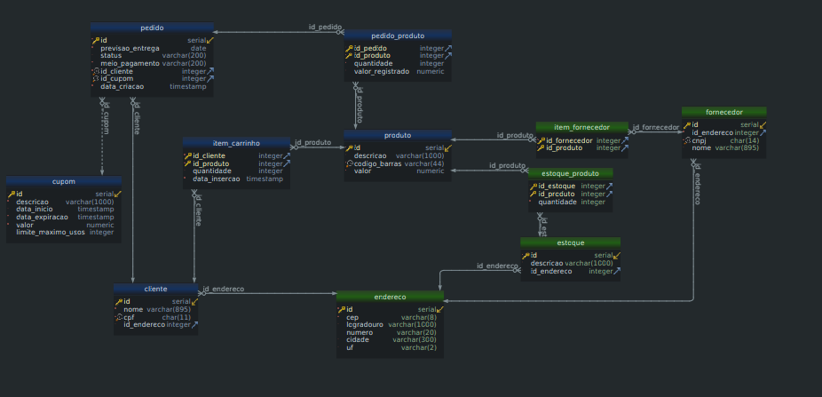

# ADA - Turma 926 - BD-PO-001

Repositório para armazenar o conteúdo visto em aula - turma 926 módulo Banco de dados (Postgresql).

# Regras de negócio definidas

## E-commerce
* Vender produtos próprios para um cliente
* ~~Vender produtos de terceiros (Marketplace)~~ Removido a fim de simplificação
* Gerenciar estoque
* Gerenciar fornecedores
* Gerenciar carrinho de compras
* Gerenciar o cadastro de clientes
* Calculo de frete
* Calculo de descontos (Campanhas/cupons)
* ~~Ser possível retirar o produto em lojas físicas~~ Removido a fim de simplificação

## Regras para os cupons

* Cupom de valor fixo;
* Vai ter uma data para começar a valer;
* Vai ter uma data para terminar de valer;
* Pode ter um limite de uso;
* Somente poderá ser utilizado 1 vez por cliente.

# Modelo conceitual do projeto

# Modelo Físico Completo

# Grupos

|             Grupo 1             |              Grupo 2              |             Grupo 3             |          Grupo 4          |
|:-------------------------------:|:---------------------------------:|:-------------------------------:|:-------------------------:|
|       Pedro Vitor De Toni       |             Job Nunes             |    Victor Henrique Martines     |     Bruno De Oliveira     |
|    Rodrigo Veras Dos Santos     |         Matheus Gaviraghi         |   Marco Antonio Loureiro Lima   | Ivana Maria Feitosa Silva |
| Maria Theresa De Sousa Ferreira | Leonardo Almeida E Silva Oliveira | Bárbara Fernanda Ayres Da Silva | Rachel Lizandra Borborema |
|     Guilherme Costa E Silva     |  Hilario Henrique Silva Ribeiro   |                                 |                           |

---

|           Grupo 5           |            Grupo 6             |          Grupo 7          |            Grupo 8             |
|:---------------------------:|:------------------------------:|:-------------------------:|:------------------------------:|
|         Ivo Augusto         | José Guilherme Da Silva Arruda |  Thiago Miguel Lapazini   |        Luciana Ferreira        |
| Ruan Derlan Sombra Oliveira |         Joyce Ribeiro          | Renan Barbieri Segamarchi | Pedro Henrique Vieira Da Silva |
| Guilherme Moreira Da Silva  |    Lucas Feliciano Bassetto    |      Gustavo Amabile      |  Matheus Felipe Lima Domingos  |

# Desafio Consultas SQL

Exemplo:
* Listar todos os meios de pagamentos utilizados
* Listar o nome e cpf dos clientes com o cep, logradouro, numero e cidade de seu endereço;
* Listar quais fornecedores fornecem determinado produto;
* Listar quantidade de produto fornecida por cada fornecedor;
* Listar todos os clientes que possuem item no carrinho;
* Listar quantidade total de cada produto em carrinho;
* Listar produtos que estão carrinho e não estão em estoque;
* Listar pedidos que foram feitos nas últimas 24 horas;
* Listar clientes que não realizaram pedidos em 2022;
* Listar o valor total de um pedido;
* Listar clientes que mais gastaram em 2022;
* Listar TOP 10 produtos vendidos esse ano;
* Listar TOP 10 cidades que mais gastaram esse ano;
* Listar clientes que mais utilizaram cupons e total economizado por eles;

Lista:

1. Listar todos os cliente que tem o nome 'ANA'.> Dica: Buscar sobre função Like
2. Pedidos feitos em 2023
3. Pedidos feitos em Janeiro de qualquer ano
4. Itens de pedido com valor entre R$2 e R$5
5. Trazer o Item mais caro comprado em um pedido
6. Listar todos os status diferentes de pedidos;
7. Listar o maior, menor e valor médio dos produtos disponíveis.
8. Listar fornecedores com os dados: nome, cnpj, logradouro, numero, cidade e uf de todos os fornecedores;
9. Informações de produtos em estoque com os dados: id do estoque, descrição do produto, quantidade do produto no estoque, logradouro, numero, cidade e uf do estoque;
10. Informações sumarizadas de estoque de produtos com os dados: descrição do produto, código de barras, quantidade total do produto em todos os estoques;
11. Informações do carrinho de um cliente específico (cliente com cpf '26382080861') com os dados: descrição do produto, quantidade no carrinho, valor do produto.
12. Relatório de quantos produtos diferentes cada cliente tem no carrinho ordenado pelo cliente que tem mais produtos no carrinho para o que tem menos, com os dados: id do cliente, nome, cpf e quantidade de produtos diferentes no carrinho.
13. Relatório com os produtos que estão em um carrinho a mais de 10 meses, ordenados pelo inserido a mais tempo, com os dados: id do produto, descrição do produto, data de inserção no carrinho, id do cliente e nome do cliente;
14. Relatório de clientes por estado, com os dados: uf (unidade federativa) e quantidade de clientes no estado;
15. Listar cidade com mais clientes e a quantidade de clientes na cidade;
16. Exibir informações de um pedido específico, pedido com id 952, com os dados (não tem problema repetir dados em mais de uma linha): nome do cliente, id do pedido, previsão de entrega, status do pedido, descrição dos produtos comprados, quantidade comprada produto, valor total pago no produto; 
17. Relatório de clientes que realizaram algum pedido em 2022, com os dados: id_cliente, nome_cliente, data da última compra de 2022;
18. Relatório com os TOP 10 clientes que mais gastaram esse ano, com os dados: nome do cliente, valor total gasto;
19. Relatório com os TOP 10 produtos vendidos esse ano, com os dados: descrição do produto, quantidade vendida, valor total das vendas desse produto;
20. Exibir o ticket médio do nosso e-commerce, ou seja, a média dos valores totais gasto em pedidos com sucesso;
21. Relatório dos clientes gastaram acima de R$ 10000 em um pedido, com os dados: id_cliente, nome do cliente, valor máximo gasto em um pedido;
22. Listar TOP 10 cupons mais utilizados e o total descontado por eles.
23. Listar cupons que foram utilizados mais que seu limite;
24. Listar todos os ids dos pedidos que foram feitos por pessoas que moram em São Paulo (unidade federativa, uf, SP) e compraram o produto com código de barras '97692630963921';
