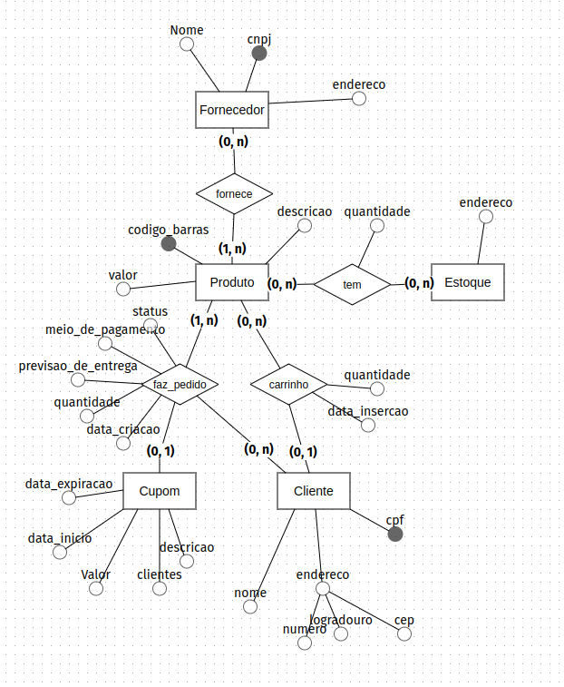

# ADA - Turma 926 - BD-PO-001

Repositório para armazenar o conteúdo visto em aula - turma 926 módulo Banco de dados (Postgresql).

# Regras de negócio definidas

## E-commerce
* Vender produtos próprios para um cliente
* ~~Vender produtos de terceiros (Marketplace)~~ Removido a fim de simplificação
* Gerenciar estoque
* Gerenciar fornecedores
* Gerenciar carrinho de compras
* Gerenciar o cadastro de clientes
* Calculo de frete
* Calculo de descontos (Campanhas/cupons)
* ~~Ser possível retirar o produto em lojas físicas~~ Removido a fim de simplificação

## Regras para os cupons

* Cupom de valor fixo;
* Vai ter uma data para começar a valer;
* Vai ter uma data para terminar de valer;
* Pode ter um limite de uso;
* Somente poderá ser utilizado 1 vez por cliente.

# Modelo conceitual do projeto

